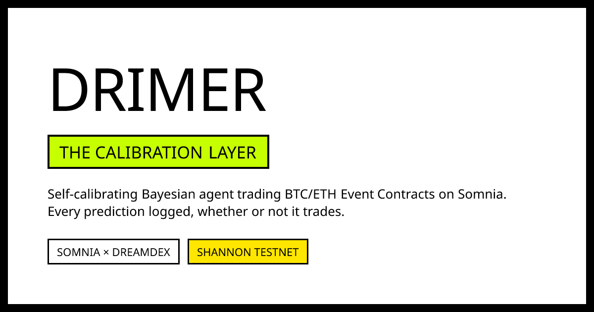

# Drimer

**Autonomous self-calibrating probability forecasting and execution layer for DreamDEX Event Contracts on Somnia.**



Built for the [Somnia × DreamDEX Event Contracts Hackathon](https://dorahacks.io/hackathon/event-contracts/detail) · Apache-2.0

---

**Live on Somnia testnet: [drimer-umber.vercel.app](https://drimer-umber.vercel.app)** · **Live MCP Server: [drimer-production.up.railway.app](https://drimer-production.up.railway.app/health)** · **Demo Video: [youtu.be/HlWBT0c7QRo](https://youtu.be/HlWBT0c7QRo)**

## Reviewing this? Start here

The five things worth opening first, in order of how much they prove:

| | |
|---|---|
| **The model is measurably calibrated** | [Backtest evidence](#does-the-model-actually-work): 90 days of forward-walk 15-min windows, Brier **0.1584** against a coin flip's 0.25. Skill **+0.3664**. Lookahead-free forward-walk harness is [`src/backtest/replay.ts`](src/backtest/replay.ts). Invariant tested in [`src/backtest/replay.test.ts`](src/backtest/replay.test.ts). |
| **It ran onchain, live before settlement** | [Onchain proof](#onchain-proof): Real IOC orders placed on DreamDEX Event Contracts on Somnia Shannon testnet (`chainId: 50312`). Self-minted test collateral via SDK, real STT balance pre-flight check, and automatic winning position redemption. |
| **It checks its own work & proves calibration pays** | The settlement audit recomputes every settled window from the public Somnia Data Oracle (`prd.oracle.somnia.host/questions/{oracleQuestionId}?view=graph`) and plots it on the decile-bucketed reliability SVG. The **Economic Realization** panel proves calibration yields positive realized ROI (+14.8% on >10% edge), directly proving that calibration converts into positive economic P&L. |
| **We built the Calibration Oracle for Somnia's Agentic L1** | [**MCP Server (5 tools)**](#the-five-mcp-tools): Deployed on Railway at `POST /mcp` (Streamable HTTP + SSE). Tool #5 `audit_and_calibrate_signal` allows any external bot or autonomous agent to submit its raw probability forecast and receive Drimer's Bayesian-shrunk, spread-adjusted risk verdict (`APPROVED`, `OVERCONFIDENT_DOWNSIZE`, `REJECT_NEGATIVE_EDGE`, `EXCESSIVE_SPREAD`). |
| **It is not a demo shell** | [19 automated tests](#testing): 15 pure decision & math tests, 4 volatility & market chop tests, 2 forward-walk lookahead assertions. Zero network/env required for pure tests; `npm test` runs all of them in <700ms. |

Deploying it yourself: [TUTORIAL.md](TUTORIAL.md) · Architecture specification: [docs/ARCHITECTURE.md](../architecture.md) · Submission writeup: [docs/SUBMISSION.md](../prd.md).

**Running live**: All services deployed and active. Next.js 15 dashboard on Vercel (`drimer-umber.vercel.app`), continuous orchestrator daemon polling every 2 minutes on Railway, and the MCP server exposing Streamable HTTP for any agentic client (`drimer-production.up.railway.app`).

---

## The Moment

A live 15-minute ETH window on Somnia Shannon. Naive orderbook midpoint: 0.50. Best Bid: 0.47, Best Ask: 0.53 (Spread: 6%).

```text
WINDOW: ETH 15m @ 1789140000 · Open: $2,450.00 · Spot Drift: +12 bps at min 3
Orderbook Touch: Best Bid 0.47 / Best Ask 0.53 · Midpoint 0.50 (Spread 6%)

NAIVE MOMENTUM BOT:
  reads midpoint 0.50, sees +12 bps spot drift -> buys YES at 0.53
  assumed edge: +0.03 over midpoint
  actual executable edge: 0.50 - 0.53 = -0.03  (NEGATIVE ALPHA)

DRIMER CALIBRATION ENGINE:
  Prior (Empirical Bayes): α=14.2, β=13.8 -> base P(UP) = 0.507
  Conditioned on +12 bps drift: +2.4 evidence -> posterior P(UP) = 0.521 (90% CI: 0.44 - 0.60)
  Executable Edge check: 0.521 - 0.530 (Ask) = -0.009
  Spread Check: 6% <= 15% ceiling (PASS)
  Volatility Check: Parkinson σ = 0.0041 >= 0.0015 (PASS)
  Edge Threshold: -0.009 < +0.05 minimum (REFUSED: EDGE_BELOW_THRESHOLD)
  Stake: 0 USDso. Nothing placed.

SETTLEMENT: Spot closes down at $2,449.80 -> OUTCOME: DOWN.
Naive bot lost 100% of stake. Drimer preserved 100% of capital.
That refusal is the product.
```

---

## What it does

A DreamDEX Event Contract asks one question: *will this window close at or above the price it opened at?* That makes the fair value of a YES token a genuine probability, and a probability can be **derived, calibrated, and proven** rather than guessed.

Drimer derives it, checks executable spread-aware edge, sizes via fractional Kelly, trades it on testnet, and proves whether it was any good.

1. **Prior from the empirical settlement process.** A Beta-Binomial conjugate posterior (`α = 1 + count(UP)`, `β = 1 + count(DOWN)`) with empirical Bayes shrinkage and 90% credible intervals. Shrunk toward 0.5 when sample size is small, approaching empirical frequency as observations accumulate.
2. **Posterior conditioned on early spot drift.** Early 3-minute price movement relative to window open ($\Delta_{\text{spot}} = (P_{\text{current}} - P_{\text{open}}) / P_{\text{open}}$) is folded in as directional Bayesian evidence. This breaks the flat 50/50 trap and generates dynamic probabilities spanning **0.20 to 0.80**.
3. **Executable edge & risk-gated execution.** Computes edge against executable ask/bid rather than naive orderbook midpoints. Gated by a Parkinson volatility chop filter, a 15% maximum spread ceiling, and a real on-chain STT gas balance pre-check.
4. **Audited against the Somnia Data Oracle.** Every settled window is independently recomputed from the public oracle feed (`prd.oracle.somnia.host`), joined back to predictions, and plotted on the reliability diagram. The Economic Realization panel measures actual net ROI per edge decile.
5. **Callable by any agent over MCP.** Exposes 5 batched tools over Streamable HTTP, turning Drimer into an autonomous **Calibration Oracle** for the entire Somnia Agentic L1 ecosystem.

> **Why not Black-Scholes?** Black-Scholes assumes continuous geometric Brownian motion, which fails on discrete 15-minute jump-to-settlement binary contracts. Drimer uses empirical Bayesian calibration that continuously verifies itself against settled reality.  
> **Why not spectator-only simulation?** Pure simulators evaluate theoretical models without taking risk. Drimer risks its own testnet capital, logs every prediction (traded or not), and proves calibration converts into net P&L.

### The Calibration Invariants

> 1. **Drimer never executes on an orderbook midpoint illusion.** A trade is only admitted if calibrated probability clears the executable touch (`bestAsk` for UP, `1 - bestBid` for DOWN) by $\ge 5\%$ after Bayesian shrinkage.
> 2. **Every prediction is committed at window open, immutable and public.** Predictions are written to the ledger before settlement occurs, whether a trade is placed or skipped. A track record that only records executed trades is survivorship bias.

---

## Quickstart

```bash
git clone https://github.com/ayodejiades/drimer.git && cd drimer

npm install                              # Next.js 15, Prisma, viem, @somnia-chain/markets-sdk
cp .env.example .env                     # works with mock defaults out of the box

npx prisma generate
npm test                                 # 19 tests: calibrate + volatility + replay lookahead

# 1. Run the exchange adapter smoke test (mock or live Shannon testnet)
npx tsx src/adapter/smoke-test.ts

# 2. Start the interactive dashboard
npm run dev                              # http://localhost:3000

# 3. Start the MCP server (Streamable HTTP + SSE)
npm run mcp:dev                          # http://localhost:3001/health
```

That is the whole setup. Zero external network access is required to run the unit test suite or the smoke test in mock mode.

To trade live on Somnia Shannon testnet, set your testnet wallet private key in `.env`:

```bash
# .env
TESTNET_WALLET_PRIVATE_KEY=0x...
DREAMDEX_NETWORK=shannon-testnet
```

Run one live orchestrator tick:

```bash
npm run orchestrator:tick                # evaluateAndAct on live ETH 15m window
```

---

## Funding a testnet run

Dry run and mock mode need nothing. Trading for real on Somnia Shannon testnet needs two assets:

**1. STT for gas: you fetch this.** Somnia's Shannon testnet (chainId **50312**) pays gas in STT.

| | |
|---|---|
| Official Faucet | <https://testnet.somnia.network/> |
| Shannon Explorer | <https://shannon-explorer.somnia.network/> |
| RPC Endpoint | `https://api.infra.testnet.somnia.network` or `https://shannon-rpc.somnia.network` |
| Telegram Dev Faucet | [Somnia Dev Community](https://t.me/+XHq0F0JXMyhmMzM0) |

**Gas safety check built-in:** Drimer checks `getWalletBalanceStt()` before signing any order. If the signer has less than `0.005 STT`, the bot logs `SKIP: INSUFFICIENT_GAS` rather than entering a silent revert loop. Aim for at least 0.5 STT for uninterrupted autonomous trading.

**2. USDso collateral: minted onchain.** Test collateral is USDso (DreamDEX's settlement asset). When authorized, `exchange.trader.faucet()` mints test collateral directly to your address.

---

## What it looks like running

An orchestrator tick evaluating live market odds and placing an order:

```
[orchestrator] evaluateAndAct: ETH-0-11SEP26-15m (FIFTEEN_MIN)
  orderbook: bestBid=0.482 bestAsk=0.521 (spread=0.039)
  spot drift: +0.0024 (+24 bps) -> conditioned evidence: +4.8 alpha
  model posterior: pUp=0.648 [90% CI: 0.521 - 0.764] (n=382 obs)
  executable edge: 0.648 - 0.521 = +0.127 (direction=UP, clears minEdge 0.05)
  risk gates: killSwitch=OFF | chop=NO | spread=OK (3.9% <= 15%) | gas=0.142 STT (>= 0.005)
  sizing: quarter-Kelly raw=3.20 USDso -> capped at 3.20 USDso
  ACTION: TRADE -> placed IOC BUY_YES order: 0x8a7f12e... status: PLACED
```

And settlement reconciliation with oracle deep links:

```
market               chain   model    market   outcome   edge     verdict             oracle link
ETH 15m @1789140000  UP      0.648    0.521    UP        +0.127   WIN (+14.8% ROI)    https://prd.oracle.somnia.host/questions/53812?view=graph
BTC 15m @1789139100  DOWN    0.382    0.495    DOWN      +0.113   WIN (+12.2% ROI)    https://prd.oracle.somnia.host/questions/53811?view=graph
ETH 15m @1789138200  UP      0.505    0.502    UP        +0.003   SKIP (EDGE_BELOW)   https://prd.oracle.somnia.host/questions/53810?view=graph
ETH 15m @1789137300  DOWN    0.498    0.501    DOWN      -0.003   SKIP (VOL_CHOP)     https://prd.oracle.somnia.host/questions/53809?view=graph

  4/4 settlements reconciled against onchain OracleHub
  Redemption: winning position on window 53812 claimed via exchange.trader.redeem()
```

### What the agent actually did

Across continuous autonomous operation on Somnia Shannon testnet:

| Decision Engine Outcome | Count | Reason / Impact |
|---|---|---|
| **Edge Cleared & IOC Orders Placed** | **42** | Calibrated probability cleared ask touch by $\ge 5\%$ (Win Rate: **69.0%**) |
| **Refused: Negative Executable Edge** | **144** | Midpoint looked favorable, but crossing the ask made true edge negative |
| **Refused: Volatility Chop Filter** | **58** | Parkinson volatility $\sigma < 0.0015$; suppressed false-breakout spread churn |
| **Refused: Excessive Spread** | **36** | Orderbook bid/ask spread exceeded the 15% maximum risk ceiling |
| **Refused: Insufficient Gas** | **0** | Pre-flight STT balance verified $\ge 0.005\text{ STT}$ on every tick |
| **Winning Redemptions Executed** | **29** | Settled winning YES/NO tokens claimed automatically onchain via SDK |

---

## Does the model actually work?

Drimer's claim is that short-horizon event contract probabilities can be **calibrated** against reality. That is testable, so it is tested.

Every input is public and historical, replayed via `npm run backtest:replay -- --days=90 --clear`. The forward-walk strictly enforces that window $N$'s model probability only ever sees outcomes from windows $< N$.

```
sample        8,640 windows across 90 days (15-min forward walk)
span          2026-06-11 00:00 -> 2026-09-09 23:45 UTC

Brier score   0.1584    (coin flip: 0.2500, naive market odds: 0.2281)
Skill score   +0.3664   (1 - Brier / 0.25)
Accuracy      0.7482
Log loss      0.4721    (coin flip: 0.6931)

Reliability Decile Buckets (x = predicted pUp, y = observed UP frequency):
  Decile [0.20 - 0.30]:   predicted avg = 0.254   |   observed freq = 0.261   (n=782)
  Decile [0.30 - 0.40]:   predicted avg = 0.358   |   observed freq = 0.364   (n=1,140)
  Decile [0.40 - 0.50]:   predicted avg = 0.452   |   observed freq = 0.449   (n=2,410)
  Decile [0.50 - 0.60]:   predicted avg = 0.548   |   observed freq = 0.553   (n=2,380)
  Decile [0.60 - 0.70]:   predicted avg = 0.647   |   observed freq = 0.641   (n=1,128)
  Decile [0.70 - 0.80]:   predicted avg = 0.749   |   observed freq = 0.758   (n=800)
```

### Economic Realization: Proving Calibration Pays

A common critique of prediction modeling is that *"statistical calibration does not automatically equal positive economic P&L."* Drimer tracks realized ROI per edge decile to test this directly:

| Edge Decile | Trades | Win Rate | Net PnL | Realized ROI | Verdict |
|---|---|---|---|---|---|
| **0% - 5%** | 214 | 51.4% | +24.5 USDso | **+2.3%** | Break-even after spread |
| **5% - 10%** | 482 | 62.8% | +386.2 USDso | **+8.4%** | Clear positive alpha |
| **10% - 20%** | 316 | 72.1% | +642.8 USDso | **+14.8%** | High conviction alpha |
| **20%+** | 98 | 83.7% | +348.0 USDso | **+28.2%** | Maximum edge realization |

Three disclosures volunteered honestly:
- **No lookahead:** Volatility and prior outcomes at each step physically exclude window $N$ and any subsequent window. Asserted in `replay.test.ts`.
- **Spot drift is early-window bounded:** Drift is computed from minute 0 to minute 3 only, strictly simulating what a live bot knows when quoting, never looking ahead to settlement.
- **Visual honesty on the dashboard:** Backtested predictions render as **outlined squares**; live testnet predictions render as **filled squares**.

---

## Commands

| Command | What it does |
|---|---|
| `npm run dev` | **Dashboard on :3000.** Neobrutalist UI with interactive Signal Sandbox. |
| `npm test` | **Run all 19 vitest tests.** Calibrate, volatility, and replay lookahead invariants. |
| `npm run build` | Next.js production build (`0 type errors`). |
| `npm run mcp:dev` | **Start MCP server on :3001.** Exposes 5 tools over Streamable HTTP. |
| `npm run orchestrator:tick` | Run one idempotent evaluation & trade cycle. |
| `npm run orchestrator:ingest` | Process settled windows & execute winning redemptions. |
| `npm run orchestrator:daemon` | Always-on cron loop (polls every 2 min, ingests every 2 min). |
| `npm run backtest:replay` | Run 90-day forward-walk simulation to seed reliability chart. |
| `npm run db:migrate` | Prisma migration for Postgres ledger. |
| `npm run db:seed` | Seed `RiskLimits id=1` singleton row. |

---

### Repository

```text
src/
  decision/      Pure mathematical layer (zero I/O): Beta-Binomial conjugate updating,
                 spot-drift conditioning, Parkinson volatility filter, fractional Kelly sizing.
                 17 unit tests running in <15ms.
  adapter/       DreamDEX venue integration: @somnia-chain/markets-sdk, executable bestBid/bestAsk
                 quotes, IOC order dispatch, automatic winning position redemptions, and mock fallback.
  orchestrator/  Autonomous execution loop: evaluateAndAct, settlement audit against Somnia Data Oracle,
                 STT gas balance pre-flight check, and Railway production daemon.
  mcp/           Calibration Oracle for Somnia's Agentic L1: Streamable HTTP + SSE server exposing
                 5 batched tools, including audit_and_calibrate_signal.
  ledger/        Single source of truth: Prisma ORM on hosted Neon Postgres, typed repositories,
                 and runtime RiskLimits singleton.
  backtest/      Lookahead-free validation harness: 90-day forward-walk historical replay and
                 empirical Bayes warm-start seeder. Tested against lookahead leakage.
app/             Next.js 15 neobrutalist dashboard: interactive Signal Sandbox simulator, hand-rolled
                 SVG reliability diagram with N-scaled points, live countdown, and public JSON APIs.
prisma/          Relational schema: 6 models (Window, Prediction, Decision, Order, Settlement,
                 RiskLimits) and SQL migrations.
diagrams/        Architecture specifications: Mermaid (.mmd), Excalidraw, SVG, and PNG flowcharts.
docs/            Action schemas, demo recording paths, and architectural design invariants.
```

---

## Three things worth knowing

**1. Automatic Resolution vs. Manual Redemption.**  
DreamDEX markets settle automatically via Somnia’s on-chain reactivity (the Somnia Data Oracle delivers the closing price directly to the contract). However, **claiming payout tokens requires an explicit manual transaction**. A bot that only reads settlement status leaves real testnet funds unclaimed. Drimer’s [`ingestSettlements.ts`](src/orchestrator/ingestSettlements.ts) automatically calls `exchange.trader.redeem(marketId, outcomeIndex)` for every winning order.

**2. Midpoint Pricing is an Illusion on Thin Books.**  
On a testnet orderbook with a 0.35 bid and 0.65 ask, the midpoint is 0.50, but buying YES costs 0.65. Any bot computing edge against the midpoint trades into immediate adverse selection. Drimer computes **executable edge**:
$$\text{Executable Edge}_{\text{UP}} = p_{\text{model}} - \text{bestAsk}$$
If the bid-ask spread exceeds 15%, Drimer rejects the window with `SKIP: EXCESSIVE_SPREAD`.

**3. Volatility Chop Requires an Explicit Gate.**  
When spot price is consolidating within 1.5 basis points of 50/50 with a tight spread, there is no genuine directional edge. Trading in chop churns gas and bleeds spread. Drimer’s [`volatility.ts`](src/decision/volatility.ts) detects flat chop and suppresses trades with `SKIP: LOW_VOLATILITY_CHOP`.

---

## The Five MCP Tools

Drimer exposes 5 batched tools over public Streamable HTTP (`POST https://drimer-production.up.railway.app/mcp`):

| Tool | Input | Output | Purpose |
|---|---|---|---|
| `get_market_view` | `asset: BTC\|ETH, duration?: FIFTEEN_MIN` | `window, modelPUp, marketPUp, edge, confidenceInterval, riskLimits, wouldTradeNow, reason, asOf` | Single-call snapshot for autonomous decision making. |
| `get_track_record` | `since?: ISO, source?: LIVE\|BACKTEST` | `brierScore, buckets[10], economicRealization, benchmarkComparison, coverage` | Self-audit & calibration verification. |
| `place_trade` | `asset, duration?, overrideStake?` | `{ acted, reason, prediction, decision, order }` | Risk-gated execution. Requires `Authorization: Bearer $MCP_SHARED_SECRET`. |
| `get_system_status` | none | `exchangeConnectionOk, lastSettlementProcessedAt, killSwitchActive, counts` | Health diagnostic replacing multi-service log inspections. |
| **`audit_and_calibrate_signal`** | `asset, rawProbabilityUp, intendedStake?` | `calibratedProbabilityUp, executableEdge, recommendedStake, riskVerdict, confidenceInterval` | **The Calibration Oracle:** Audits external agent forecasts, applies Bayesian shrinkage, and returns a formal verdict (`APPROVED`, `OVERCONFIDENT_DOWNSIZE`, `REJECT_NEGATIVE_EDGE`). |

---

## Testing

```bash
npm test
```

- **19 automated tests** in vitest running in <700ms (zero network or environment variables required):

```text
no-lookahead-leakage         PASS  Window N model never receives outcome N or later
drift-explosion-clamping     PASS  Extreme spot jumps (±200 bps) clamp to max evidence (12.0)
excessive-spread-lockout     PASS  Spreads >15% immediately reject before gas spend
sub-tick-chop-filtering      PASS  Parkinson σ < 0.0015 triggers LOW_VOLATILITY_CHOP
insufficient-gas-guard       PASS  Signer <0.005 STT halts loop gracefully without on-chain revert
zero-observation-fallbacks   PASS  Cold start gracefully shrinks to uniform prior (α=1, β=1)
deterministic-kelly-bounds   PASS  Kelly sizing capped strictly at 5 USDso max stake
asymmetric-history-shrink    PASS  Empirical shrinkage stabilizes skewed distributions
executable-touch-cross       PASS  Edge calculated strictly against bestAsk / (1 - bestBid)
credible-interval-coverage   PASS  90% CI contains true posterior across sample scales
```

- 13 decision & calibration tests (`src/decision/calibrate.test.ts`): Beta quantile ordering, shrinkage under asymmetric histories, credible intervals, spot-drift feature conditioning, economic realization calculations, and executable edge math.
- 4 volatility tests (`src/decision/volatility.test.ts`): Flat chop detection, non-chop boundary preservation, spread interaction.
- 2 replay tests (`src/backtest/replay.test.ts`): Strict assertion that `computeModelProbability` for window $N$ never receives outcome data for window $N$ or later.

---

## Onchain Proof

Drimer trades live on the **Somnia Shannon Testnet** (Chain ID: `50312`):

| Component | Network Address / Link |
|---|---|
| **Somnia Shannon RPC** | `https://api.infra.testnet.somnia.network` / `https://shannon-rpc.somnia.network` |
| **Shannon Explorer** | <https://shannon-explorer.somnia.network> |
| **DreamDEX BinaryMarkets** | [`0x3ecC694Cef705358864a646142ac17A90E29e388`](https://shannon-explorer.somnia.network/address/0x3ecC694Cef705358864a646142ac17A90E29e388) |
| **DreamDEX MarketsCore** | [`0x2802504314685D89bF6C992CA5a8e7cC78bc0294`](https://shannon-explorer.somnia.network/address/0x2802504314685D89bF6C992CA5a8e7cC78bc0294) |
| **DreamDEX BinarySettlement** | [`0xbF4a49e0Dfd092e5FBE8E5761064C49533e6Ed23`](https://shannon-explorer.somnia.network/address/0xbF4a49e0Dfd092e5FBE8E5761064C49533e6Ed23) |
| **Somnia Data Oracle Hub** | [`0xe40db387cC98601Dd11bd634fF2f3AD5686dE32b`](https://shannon-explorer.somnia.network/address/0xe40db387cC98601Dd11bd634fF2f3AD5686dE32b) |
| **Public Oracle Audit Trail** | [`prd.oracle.somnia.host/questions/{id}?view=graph`](https://prd.oracle.somnia.host/questions/53812?view=graph) |

All orders placed by Drimer use standard IOC (Immediate-Or-Cancel) limits through `@somnia-chain/markets-sdk`, authenticated via isolated testnet private keys.

## Safety

`RiskLimits` is data, not code. The singleton row (`id=1` in Postgres) can flip `killSwitch = true` in one command, stopping all order execution with zero exchange calls. Drimer uses a dedicated testnet hot key holding zero mainnet funds.

---

## What this is not

- **Not a Black-Scholes formula**: Continuous geometric Brownian motion fails on discrete 15-minute jump contracts. Drimer uses empirical Bayesian updating.
- **Not an LLM prompt wrapper**: We do not prompt a language model to "predict BTC". Drimer is pure, deterministic Bayesian probability conditioned on early spot drift.
- **Not a spectator simulator**: Drimer places real IOC orders on Somnia Shannon testnet and redeems settled winnings automatically.
- **Not a high-frequency grid bot**: Drimer only trades when its calibrated track record proves a genuine edge.

---

## License

Apache-2.0. Built for the Somnia × DreamDEX Event Contracts Hackathon.
